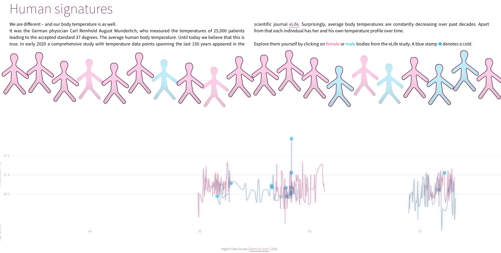
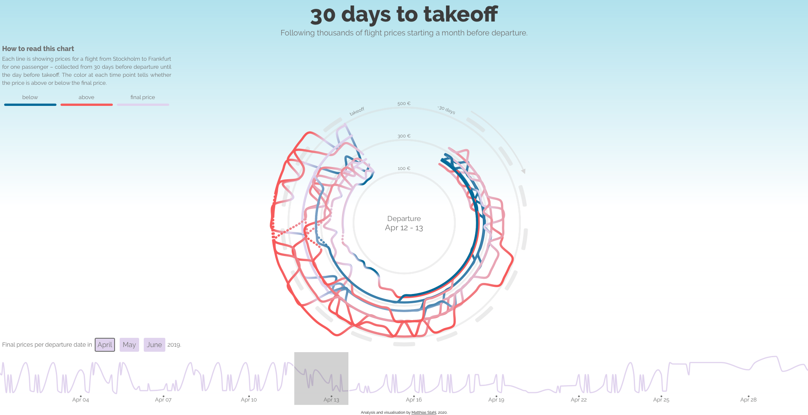

# Svelte ❤️ D3
> A talk about how to use D3 within Svelte

## The slides
[PDF slides](./slides/svelte_loves_d3.pdf)

[Keynote slides](./slides/svelte_loves_d3.key)

## The code examples in the REPL
[What is D3 used for?](https://svelte.dev/repl/cb8161238d8749b5a6fe90750288cc55?version=3.18.1)

[How to make it a bit more svelty](https://svelte.dev/repl/6c4ceb4946464934bd0b0999deadc9cd?version=3.18.1)

[Svelte completely got in love with D3](https://svelte.dev/repl/d86b3e7af77846fdba510946fce09c71?version=3.18.1)

## The Svelte-D3 projects
[Human signatures](https://higsch.github.io/body-temp/) ([Code](https://github.com/higsch/body-temp/tree/master/app-svelty)) (human body temperatures of different individuals over time)

[Flight prices](https://higsch.github.io/flyhigh/) ([Code](https://github.com/higsch/flyhigh/tree/master/visualisation/app)) (following thousands of flight prices from Stockholm to Frankfurt)

[Childhood mortality](https://higsch.github.io/childhood-mortality/) ([Code](https://github.com/higsch/childhood-mortality)) (how under five year death rates changed over the past years)

# License / Reuse
All projects are under the MIT license. Feel free to use, copy, modify, enjoy!
